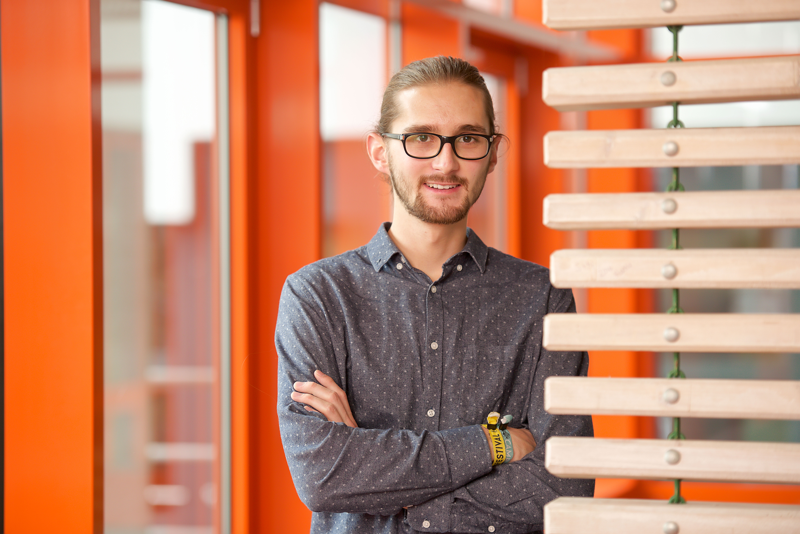

## About

I'm a doctoral candidate in computational social science at the [Graduate School of Decicison Sciences](https://www.gsds.uni-konstanz.de/) and a member of the [Center for Data and Methods](https://www.polver.uni-konstanz.de/en/cdm/people/students/kling/) at the [University of Konstanz](https://www.uni-konstanz.de/en/).

In my dissertation, I analyze social media users' consumption awareness. In particular, I focus on the accuracy of Twitter users' statements about their online activity and the political heterogeneity of their Twitter network. Further, I analyze the normative perceptions of biased news diets. My work utilizes online surveys in addition to analyses of social media data. I received both my BA (Major in Sociology, Minor in Statistics) and my MSc (Social and Economic Data Analysis) from the University of Konstanz.
